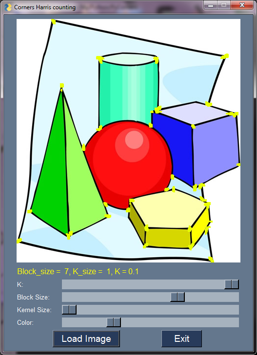
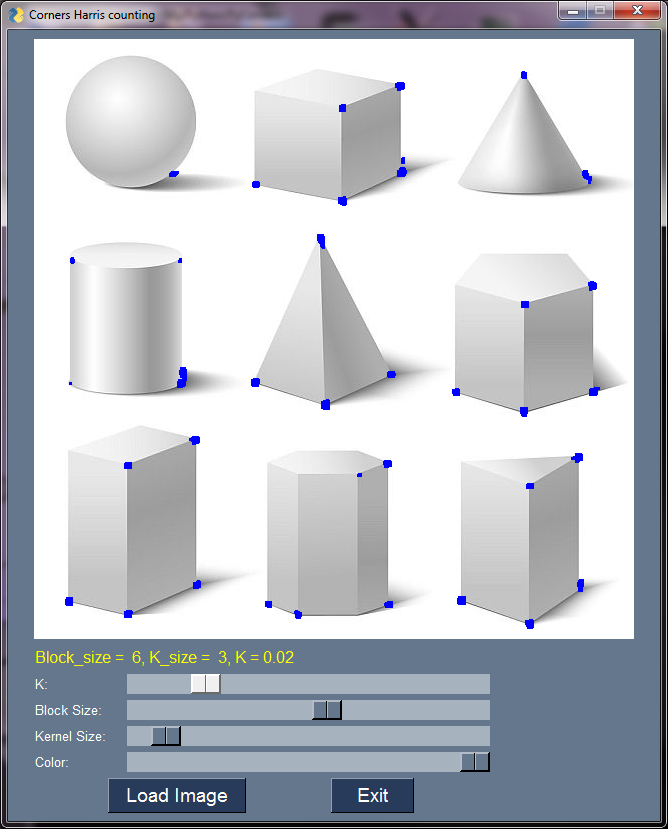
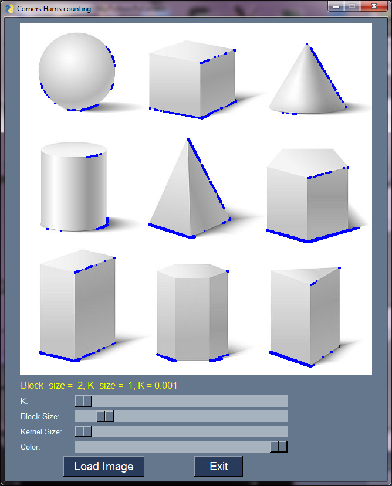

# PyCorners
Test detection of corners using Harris method from OpenCV

## SYNOPSIS
      python CornersHarris.py
	  
## Screenshots

# Requirements:

* Python
* OpenCV
* PySimpleGUI

## AUTHOR
   An0ther0ne

## LICENSE
   GNU General Public License v3.0
   