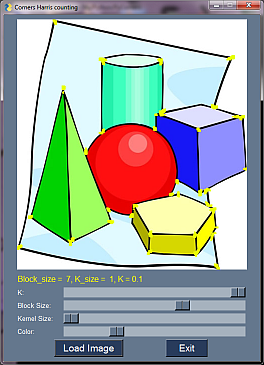
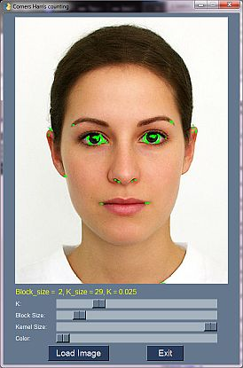
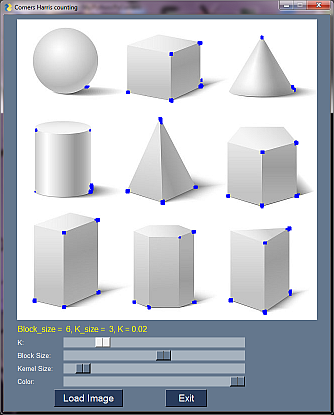
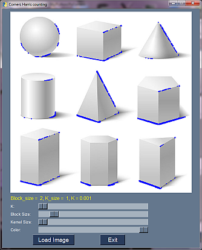

# PyCorners
Test detection of corners using Harris method from OpenCV.
I written this simple program to test this method on different images with various parameters.

## SYNOPSIS
      python CornersHarris.py

OpenCV have a method called 'cornerHarris', which helps to find corners on the picture. 

      cv2.cornerHarris(igray, Block_size, K_size, K)

Where:

* Block_size - size of neighborhood considered for corner detection
* K_size - Aperture parameter of Sobel derivative used.
* K - Harris detector free parameter in the equation:
      
![equation_1][img/eq1.png]

## Screenshots

## Requirements:

* Python
* OpenCV
* PySimpleGUI

## AUTHOR
   An0ther0ne

## LICENSE
   GNU General Public License v3.0

## SEE ALSO
* [cornerHarris()](https://docs.opencv.org/master/dd/d1a/group__imgproc__feature.html#gac1fc3598018010880e370e2f709b4345)

